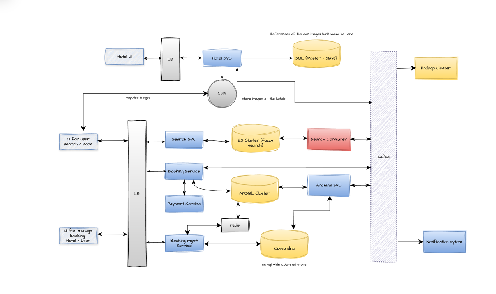

### Hotel Booking 

#### Functional Requirements
1. Hotel 
   1. Onboarding hotels to the platform
   2. Updates to existing hotels (availability, pricing, etc.)
   3. Booking management (view, cancel, modify)
2. User
   1. Search for hotels based on location, dates, price, etc.
   2. Book Hotels
   3. View and manage bookings
3. Analytics

#### Non-Functional Requirements
- low latency for search and booking operations
- high availability and reliability

#### Constraints
- 500k hotels
- 10M Rooms
- 1000 Rooms / hotel

---
#### Why Kafka?
Use Kafka when a system needs to handle a continuous stream of events where multiple services must process the same data independently, reliably, and at scale.
It is suited for event-driven architectures that require decoupling, durability, and the ability to replay past events

#### Why Kafka Fits a Hotel Booking System ?
- A booking triggers many actions (payment, room lock, email, analytics). Kafka lets each happen independently instead of chaining API calls.
- Prevents system failures from spreading. If email or analytics is down, bookings still succeed.
- Handles traffic spikes (sales, holidays) by buffering events and processing them gradually.
- Ensures no booking event is lost because events are stored durably.
- Allows replay of past bookings for audits, fixes, or new features.
- Makes it easy to add new services later without changing the booking service.

---
#### Archival Service
Moves old bookings out of MySQL into long-term storage.

**How it works:**
- Listens to booking events from Kafka
- Periodically pulls aged data from MySQL
- Copies historical bookings to cheap storage (data lake / cold DB / object store)
- Verifies the copy
- Deletes or compacts that data from MySQL

**Why This Is Needed**

MySQL should only hold:
- Active bookings
- Recent history needed for user queries

But hotel systems accumulate years of completed stays that are:
- Rarely queried
- Required only for audit, finance, analytics

--- 
#### Why Casandra ?
We are using Cassandra for the database because it is a NoSQL database and it is easy to scale. Once the data is old the archive svc moves the old data from
sql to the casandra. This is because the old data is not accessed frequently.

#### Cassandra Is Optimized for Historical / Large-Volume Data (OLAP-like Storage)

Archival service moves completed bookings into Cassandra because it provides:

- **Horizontal scalability** : Can store years of booking history across many nodes cheaply.
- **Write-heavy efficiency** : Archival is mostly append-only writes. Cassandra is built for that.
- **No need for joins or transactions** : Historical data is rarely updated. You just store and read by key/date.
- **High compression + lower cost storage** : Much cheaper than keeping everything in MySQL SSD-backed tables.

---

### Components of the System

Steps:
- **Check if the rooms are available**
  1. Before we take booking we look if rooms are available or not. if yes then next step otherwise return to the user
- **Booking initiated** 
  1. add entry in booking table and temporarily block the rooms via decremenenting the room availability
- **Put in the redis **TTL** ( time to live)**
  1. Redis mechanism to keep the data in memory for some time and when it expires redis sends a callback notification.
  2. Whenever the booking is initiated the svc puts an entry to the redis ttl with some expiry timing , the payment should be done before the expiry otherwise the booking would not be completed.
- **Put in kafka**
  1. Meanwhile the service can push events to kafka.
- **Redirect to payment**
  1. Now comes the payment service 
     - Payment Success: keep everything the same way just change the **state** of the booking from reserved to booked.
     - Payment Failure: rollback the booking update state to failure and release the rooms by incrementing the room availability.

