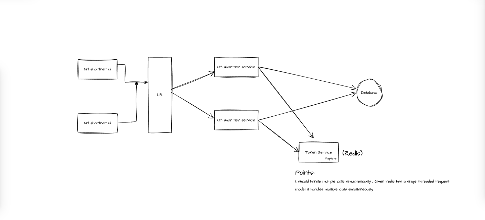

### URL Shortner

#### Requirements
1. Shorten a URL
2. Redirect to the original URL when the shortened URL is accessed
3. The system should be able to generate unique short URLs

#### Non-Functional Requirements
- Should have analytics to track the number for report generation and to understand the user behavior
- The system should be consistent and available
- The system should be able to handle a large number of requests

#### System Components
1. **Database**
   - Maps short URL to original URL
   - Stores metadata: clicks, creation date, etc.
2. **URL Shortening Service**
   - Generates short URLs
   - Stores mappings in DB
   - Uses Auto Incremental Counter Service to generate short URLs (cons: hackers can ddos the system)
   - Handles redirection
3. **Counter Service**
   - Maintains a global counter
   - Services request batches of tokens (ranges) to avoid collisions
   - Independent from URL service (ensures unique short URLs even if URL service restarts)
   - Losing some tokens is acceptable due to large range
   - It can be **redis** , coz redis has single threaded request model , so even if 2 repicas call it at a time, it will not cause any issue

#### Analytics Tracking
- Use Kafka as a secondary store for analytics
- Batch analytics data via message queue before sending to Kafka (reduces bottleneck)

#### Notes
- Redis can be used for range generation and as a cache for URL mappings
- Do **not** use Redis as the primary DB (risk of data loss)